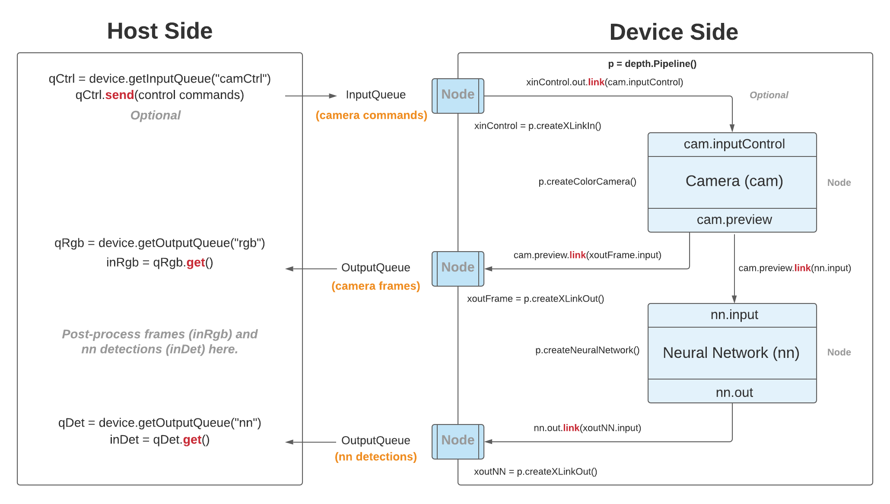

# Object Detection using OAK-D

This project uses the mobilenet-ssd model for performing object detection. The model is trained to classify objects in the following class labels: 

**background, aeroplane, bicycle, bird, boat, bottle, bus, car, cat, chair, cow, diningtable, dog, horse, motorbike, person, pottedplant, sheep, sofa, train, tvmonitor**

# Pipeline

# Local installation

- Follow the instructions on [docs.luxonis.com](https://docs.luxonis.com/) to install the required dependencies as per your environment.
- Clone this repository.
- `cd` into the project directory and run `pip install opencv-python numpy` (in a virtual environment or system wide).
- Connect OAK to the host and run `python3 mobilenet_detection_oakd.py`
